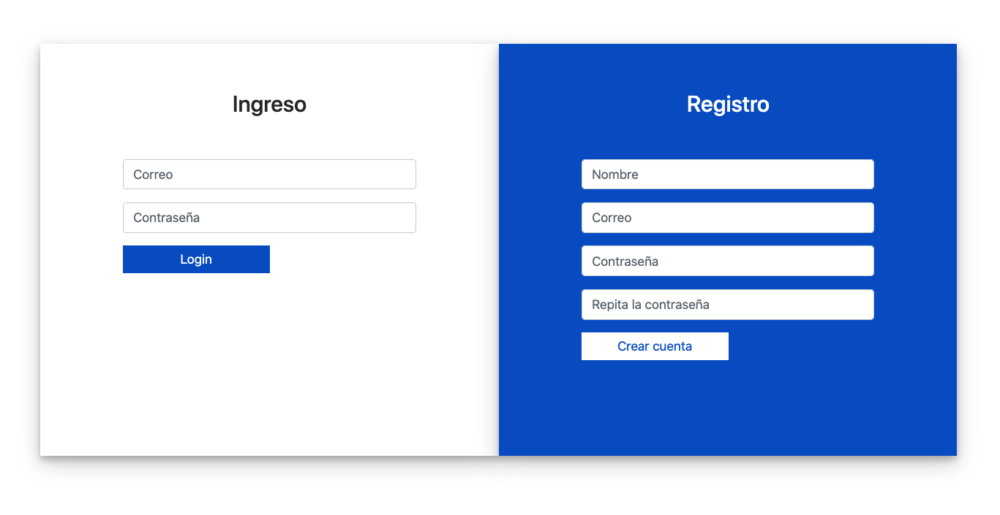
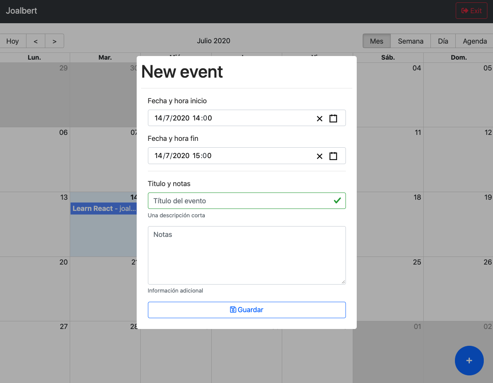
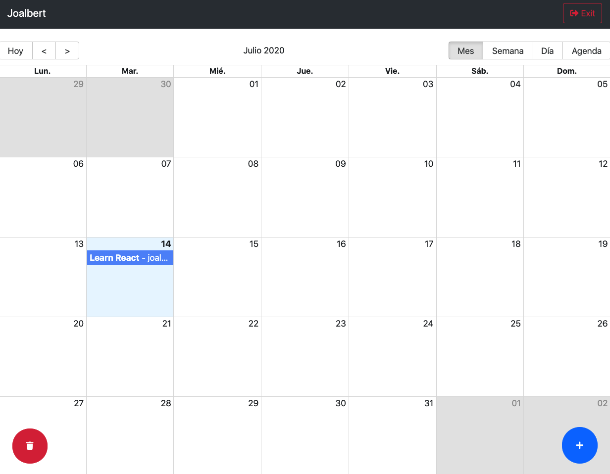
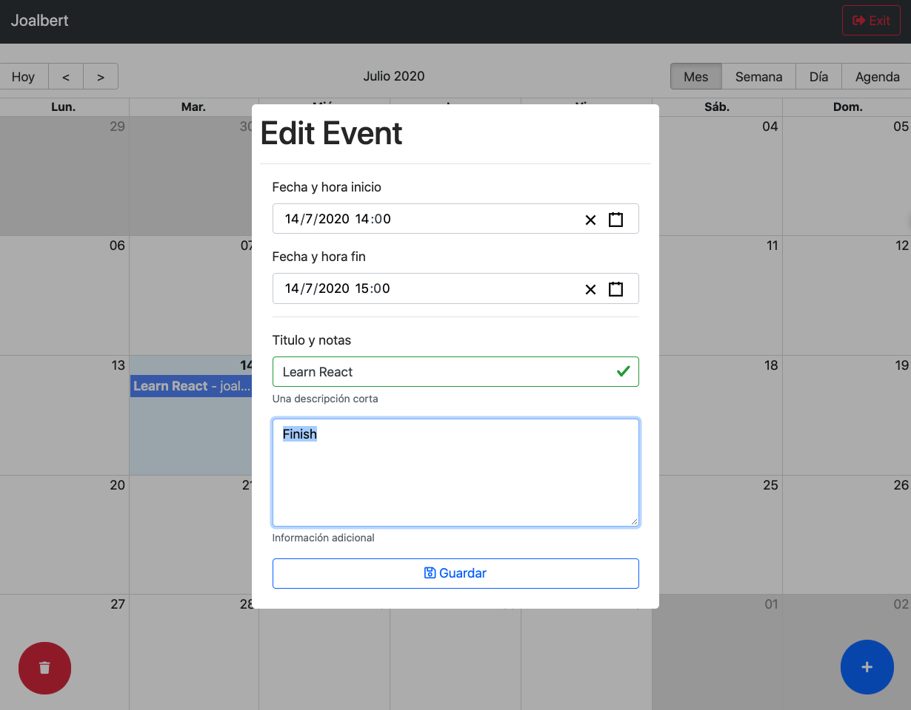
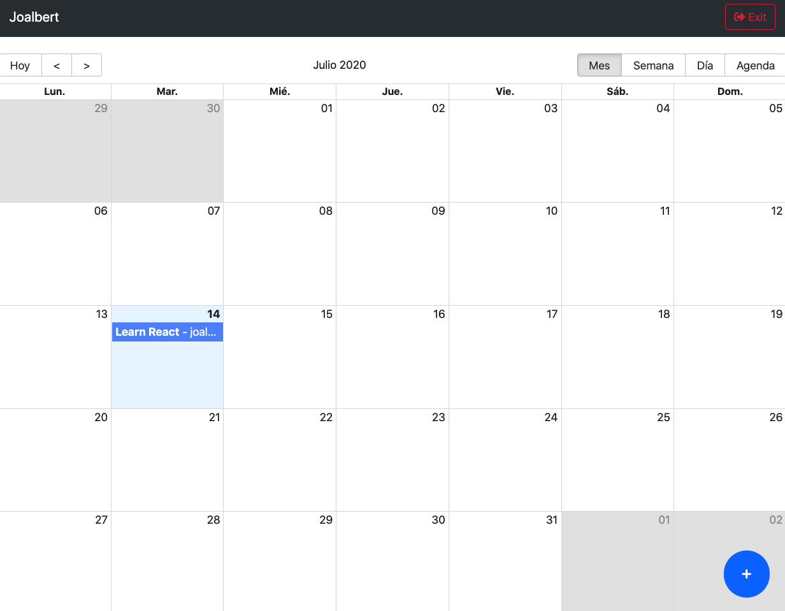
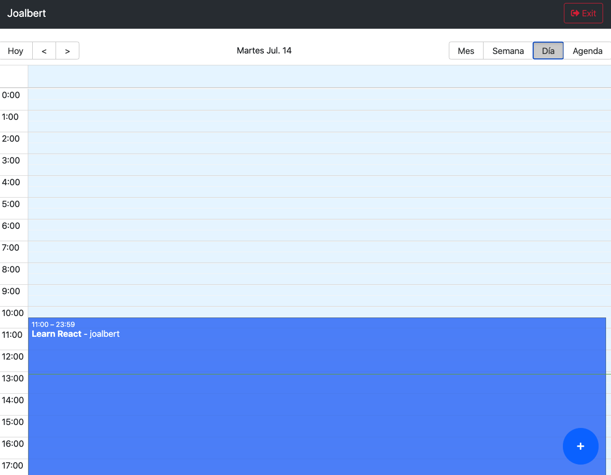
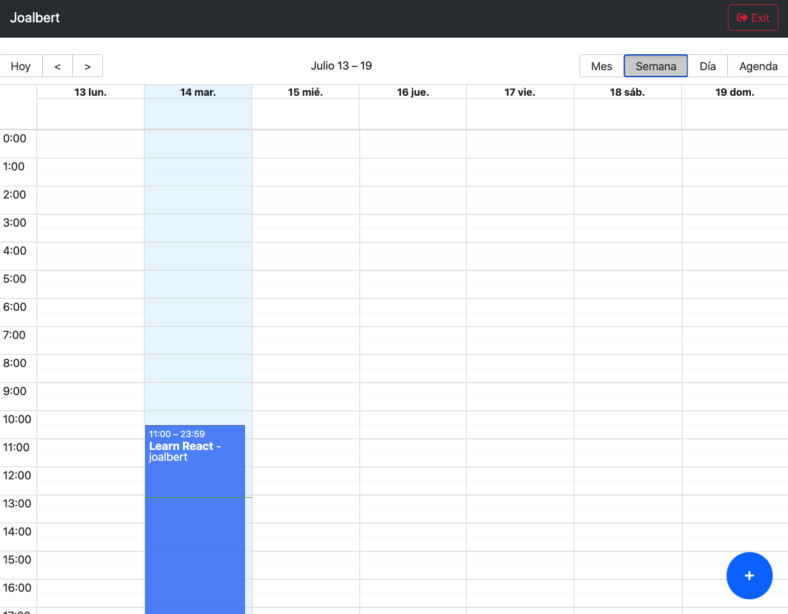
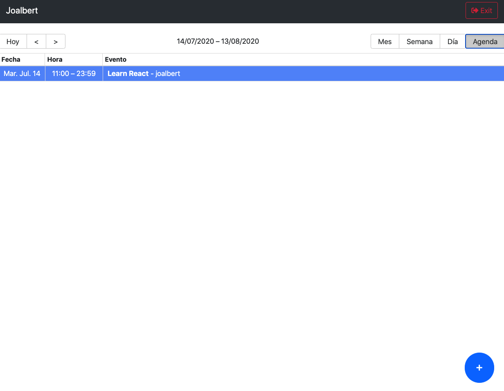

# Calendar App

- [Bootstrap][bootstrap]
- [Font Awesome CDN][font_awesome]
- [Sweetalert 2][sweetalert2]

- [React Router][react_router]
- [Big Calendar][react_big_calendar]
- [Datetime Picker][react_datetime_picker]
- [Moment][momentjs]

- [Redux][reduxjs]
- [React Redux][react_redux]
- [Redux devtools][redux_devtools]

- [Enzyme][enzymejs]
- [enzyme-to-json][enzyme_to_json]

[bootstrap]: https://getbootstrap.com/docs/4.5/getting-started/introduction
[font_awesome]: https://cdnjs.com/libraries/font-awesome
[sweetalert2]: https://sweetalert2.github.io/

[react_router]: https://reacttraining.com/react-router/web/guides/quick-start
[react_big_calendar]: http://jquense.github.io/react-big-calendar/examples/index.html
[react_datetime_picker]: https://projects.wojtekmaj.pl/react-datetime-picker/
[momentjs]: https://momentjs.com/

[reduxjs]: https://es.redux.js.org/
[react_redux]: https://react-redux.js.org/
[redux_devtools]: https://github.com/zalmoxisus/redux-devtools-extension#usage

[enzymejs]: https://enzymejs.github.io/enzyme/
[enzyme_to_json]: https://www.npmjs.com/package/enzyme-to-json

### Backend repository

- [Calendar API][calendar_api]

[calendar_api]: https://github.com/joalbertg/express-calendar_app

### Project Structure

> run `tree -I "node_modules|screenshots|public"`
```shell
.
├── Dockerfile
├── README.md
├── docker-compose.yml
├── package.json
├── src
│   ├── CalendarApp.js
│   ├── actions
│   │   ├── auth.js
│   │   ├── events.js
│   │   ├── index.js
│   │   └── ui.js
│   ├── components
│   │   ├── auth
│   │   │   ├── LoginScreen.js
│   │   │   ├── index.js
│   │   │   └── login.css
│   │   ├── calendar
│   │   │   ├── CalendarEvent.js
│   │   │   ├── CalendarModal.js
│   │   │   ├── CalendarScreen.js
│   │   │   └── index.js
│   │   └── ui
│   │       ├── AddNewFab.js
│   │       ├── DeleteEventFab.js
│   │       ├── Navbar.js
│   │       └── index.js
│   ├── helpers
│   │   ├── calendar-messages-es.js
│   │   ├── fetch.js
│   │   └── prepare-events.js
│   ├── hooks
│   │   ├── index.js
│   │   └── useForm.js
│   ├── index.js
│   ├── reducers
│   │   ├── authReducer.js
│   │   ├── calendarReducer.js
│   │   ├── index.js
│   │   ├── rootReducers.js
│   │   └── uiReducer.js
│   ├── routers
│   │   ├── AppRouter.js
│   │   ├── PrivateRoute.js
│   │   ├── PublicRoute.js
│   │   └── index.js
│   ├── setupTests.js
│   ├── store
│   │   ├── index.js
│   │   └── store.js
│   ├── styles.css
│   └── types
│       ├── index.js
│       └── types.js
└── yarn.lock

12 directories, 42 files
```

### Screenshots

<p align="center">
  <kbd>
    
  </kbd>
</p>

<p align="center">
  <kbd>
    
  </kbd>
</p>

<p align="center">
  <kbd>
    
  </kbd>
</p>

<p align="center">
  <kbd>
    
  </kbd>
</p>

<p align="center">
  <kbd>
    
  </kbd>
</p>

<p align="center">
  <kbd>
    
  </kbd>
</p>

<p align="center">
  <kbd>
    
  </kbd>
</p>

<p align="center">
  <kbd>
    
  </kbd>
</p>

### Installs

With `package.json` and dependencies
```shell
docker-compose run app yarn
```

Without dependencies
```shell
docker-compose run app yarn add react-router-dom react-big-calendar moment validator
docker-compose run app yarn add react-datetime-picker react-modal sweetalert2
docker-compose run app yarn add react-datetime-picker react-redux redux redux-thunk
docker-compose run app yarn add link-module-alias --dev
docker-compose run app yarn add enzyme enzyme-adapter-react-16 enzyme-to-json redux-mock-store --dev
```

### Start project

> run `docker-compose up`

### Tests

> run `docker-compose run app test --runInBand`, or

> run `docker-compose run app test --maxWorkers=4`

#### Link module alias

> run `docker-compose run app yarn preinstall` for clean alias.

> run `docker-compose run app yarn postinstall` for generate alias.

```json
...
"scripts": {
  ...
  "preinstall": "command -v link-module-alias && link-module-alias clean || true",
  "postinstall": "link-module-alias",
  "alias:build": "yarn preinstall && yarn postinstall"
},
"_moduleAliases": {
  "~root": ".",
  "~src": "./src",
  "~actions": "./src/actions",
  "~components": "./src/components",
  "~helpers": "./src/helpers",
  "~hooks": "./src/hooks",
  "~reducers": "./src/reducers",
  "~routers": "./src/routers",
  "~store": "./src/store",
  "~types": "./src/types"
},
...
```

```javascript
import React from 'react';
import ReactDOM from 'react-dom';

import App from '~src/CalendarApp';

ReactDOM.render(
  <App />,
  document.getElementById('root')
);
```

### Deploy to Heroku platform

> run `docker-compose run app yarn add serve`
```json
...
"scripts": {
  "dev": "react-scripts start",
  "start": "serve -s build",
  "build": "react-scripts build",
  "test": "react-scripts test --env=jsdom",
  "eject": "react-scripts eject",
  "heroku-postbuild": "yarn build"
},
...
"engines": {
  "node": "14.0.0",
  "yarn": "^1.17.3"
}
...
```

